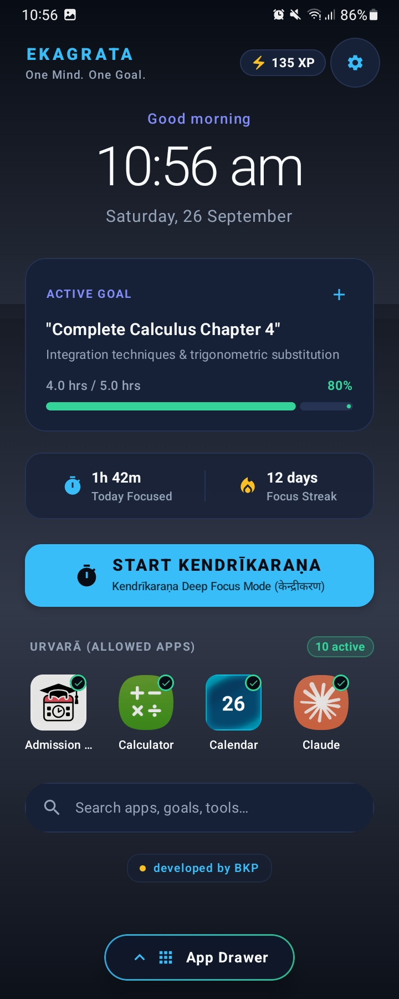
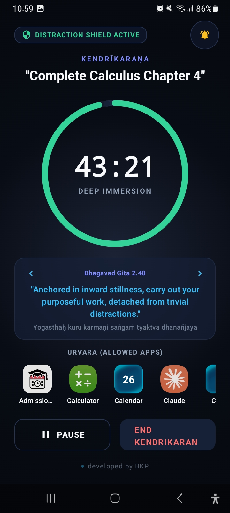
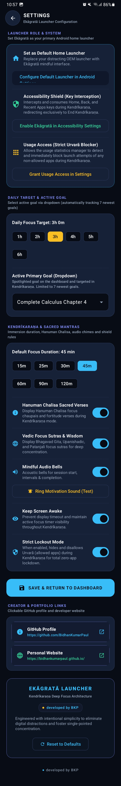

<div align="center">

# 🧘 Ekagrata

### *एकाग्रता — a state of single-minded focus*

**A minimalist Android launcher built to help you focus, not scroll.**

[](https://kotlinlang.org)
[](https://developer.android.com)
[](https://github.com/BidhanKumarPaul/Ekagrata/blob/main/LICENSE)
[](#)

</div>

---

## ✨ What is Ekagrata?

**Ekagrata (एकाग्रता)** — *a state of single-minded focus* — is an Android launcher built to replace your distracting home screen with a mindful, goal-driven interface. Instead of an endless grid of tempting apps, Ekagrata gives you **one active goal**, a **focus timer**, and a **hard shield** against everything that isn't relevant to what you're trying to do.

> Built solo by [Bidhan Kumar Paul](https://github.com/BidhanKumarPaul) under the **BKP IT** banner.

---

## 🚀 Features

- 🎯 **Goal-centered dashboard** — track one active goal with hours logged, progress %, focus streaks, and XP
- 🧘 **Kendrīkaraṇa — Deep Focus Mode** — a distraction-shielded timer session with rotating focus quotes (Bhagavad Gita verses, Vedic sutras)
- 🛡️ **Distraction Shield** — accessibility-based key interception blocks Home/Back/Recents during a focus session
- 🌱 **Urvarā (Allowed Apps)** — whitelist only the apps you actually need; everything else is blocked
- 🔒 **Strict Lockout Mode** — optional zero-app lockdown for total immersion
- ⏱️ **Configurable session lengths** — 15 to 120-minute presets, plus custom daily focus targets
- 🔔 **Mindful audio bells** — acoustic chimes for session start, intervals, and completion
- 🕉️ **Hanuman Chalisa & Vedic wisdom** — optional sacred verses displayed during focus sessions
- ⚙️ **Full customization** — usage access, keep-screen-awake, and one-tap reset to defaults

---

## 📱 Screenshots

<div align="center">

| Dashboard | Kendrīkaraṇa (Focus Mode) | Settings |
|:---:|:---:|:---:|
|  |  |  |
| *"One Mind. One Goal."* | *Deep Immersion, distraction shield active* | *Full launcher configuration* |

</div>

---

## 🛠️ Tech Stack

| Category | Tool |
|---|---|
| Language | Kotlin |
| Build System | Gradle (Kotlin DSL) |
| Platform | Android |
| CI/CD | GitHub Actions |

---

## 🙋 Getting Started [For Users]

No coding required — just grab the APK and choose how deep you want to go.

<div align="center">

### 🔗 [**⬇️ Download the latest release**](https://github.com/BidhanKumarPaul/Ekagrata/releases/tag/v.0.0.0-alpha)

</div>

<table>
<tr>
<td valign="top" width="50%">

**🔥 Full Focus**

1. **[Download](https://github.com/BidhanKumarPaul/Ekagrata/releases/tag/v.0.0.0-alpha)** the APK
2. **Install** it on your Android device
3. **Set Ekagrata as your default launcher**
4. ✅ **Restore full focus** — your home screen is now distraction-shielded by default

</td>
<td valign="top" width="50%">

**🌤️ Light Focus**

1. **[Download](https://github.com/BidhanKumarPaul/Ekagrata/releases/tag/v.0.0.0-alpha)** the APK
2. **Install** it on your Android device
3. **Use it as a normal app** (keep your current launcher)
4. 🌗 **Restore partial focus** — launch Kendrīkaraṇa sessions on demand, whenever you need to lock in

</td>
</tr>
</table>

> ⚠️ This is an early **alpha** build — expect rough edges, and back up anything important before setting it as your default launcher.

---

## 🧑‍💻 Getting Started [For Developers]

### Prerequisites
- Android Studio (latest stable)
- JDK 17+

### Setup

```bash
# Clone the repository
git clone https://github.com/BidhanKumarPaul/Ekagrata.git
cd Ekagrata

# Copy the environment template and fill in your values
cp .env.example .env

# Open in Android Studio and let Gradle sync
```

Then hit **Run ▶️** on your device or emulator.

---

## 🗂️ Project Structure

```
Ekagrata/
├── app/                    # Main application module
├── gradle/                 # Gradle wrapper files
├── .github/workflows/      # CI/CD pipelines
├── build.gradle.kts        # Root build config
├── settings.gradle.kts     # Project settings
└── .env.example            # Environment variable template
```

---

## 🤝 Contributing

This is currently a solo project, but suggestions and issues are welcome!

1. Fork the repo
2. Create a feature branch (`git checkout -b feature/amazing-feature`)
3. Commit your changes
4. Open a pull request

---

## 📄 License

Distributed under the MIT License. See [LICENSE](https://github.com/BidhanKumarPaul/Ekagrata/blob/main/LICENSE) for details.

---

<div align="center">

**Made with 🧘 focus by [BKP IT](https://github.com/BidhanKumarPaul)**

<sub>If Ekagrata helps you focus, consider giving it a ⭐</sub>

</div>
